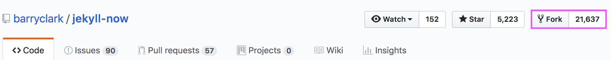
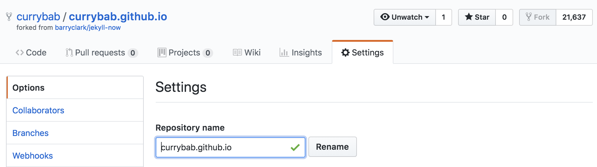
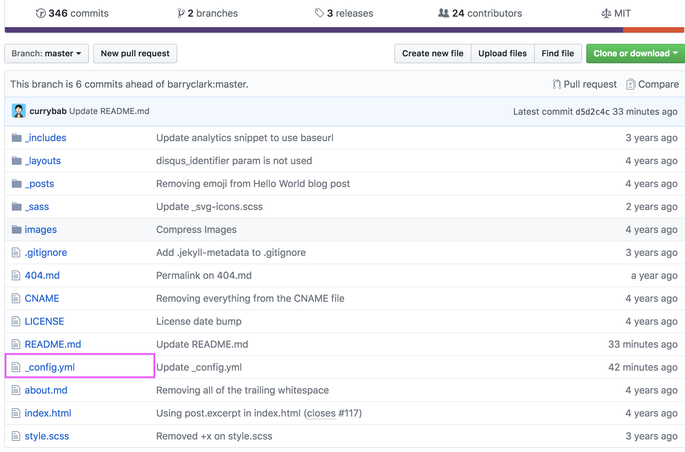
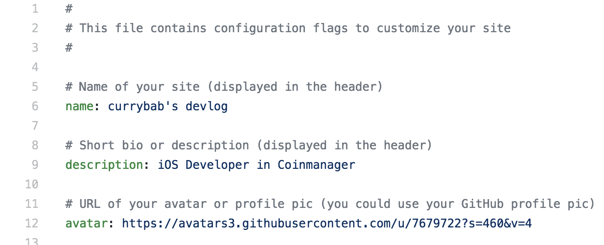
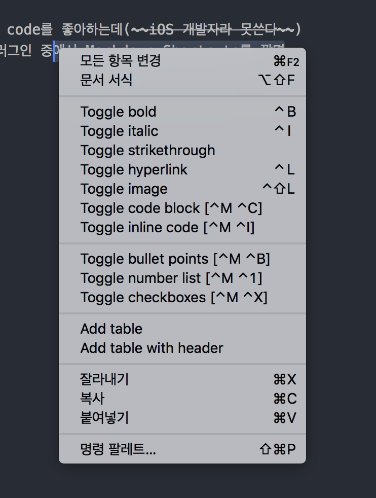

드디어 미루고 미루던 블로그를 시작하였다.

medium에 계정도 만들어두고 steemit에도 계정을 만들어 두었지만 글은 한번도 작성을 못했었다...

차라리 익숙한 마크다운으로 하면 어떨까 싶어서 github로 시작하게 되었다

큰맘을 먹고 시작해도 귀찮아지면 설명이 짧아질 예정이다...

첫글은 시작을 알리는 블로그 생성기이다! (사실 할게 별로 없당~)

우선 [github](https://github.com) 계정을 생성한 후에, [Jekyll now github page](https://github.com/barryclark/jekyll-now) 에 접속한다.

접속을 하고 나면 상단에 Fork라는 이름의 버튼이 보이는데 해당 버튼을 눌러 내 계정에 포크를 뜬당




내 계정에 와서 포크 뜬 repository의 세팅페이지에서 다음과 같이 
Repository Name을 계정이름.github.io으로 바꾸어 주면 세팅이 완료된다



여기까지 완료한 이후에는 프로젝트 메인페이지로 돌아가서 _config.yml 파일을 연다



그러면 다음과 같이 간단하게 입력해서 블로그의 이름이나 정보 등등을 입력할 수 있다



이제 _posts 폴더아래에 (연도)-(월)-(일자)-(제목).md 파일을 만들고 상단에

```
---
layout: post
title: Jekyll Now로 쉽게 github 블로그 시작하기
---
```
과 같이 적은 후 아래에 글을 작성하면 된당!


**그런데 사실 이렇게 하면 매번 깃허브에 와서 글을 수정하기가 나는 매우 귀찮다**

그래서 로컬에서 작성하고 로컬에서 페이지를 확인하고자 하는 방법을 적고자 한다.

먼저 jekell을 다운로드 받아야한다. 
나같은 경우에는 mac을 사용하기 때문에 기본으로 ruby가 깔려 있지만 없으신 분들은 2.2.5 이상의 버전을 받으라고 한다.

```
gem install bundler jekell
```

을 통해 다운로드 한다. 아.. 
```
ERROR:  While executing gem ... (Gem::FilePermissionError)
    You don't have write permissions for the /Library/Ruby/Gems/2.3.0 directory.
```
와 같은 오류가 난다...

권한 문제인데 찾아보니 나같은 경우에는 루비를 별로 사용할 일이 없기 때문에 rbenv를 쓰는 방법 대신에 간단히
`sudo chown -R $USER /Library/Ruby/Gems/` 을 통해 해결하였다.

다음!!

```
gem install github-pages
```
을 한다. 이게 하는 일은 나의 local에다가 github pages와 같은 환경을 구성하게 해준다고...

이제 `git clone`을 통해 나만의 repository를 복사한 후에 프로젝트 폴더에 들어가서

터미널에 `jekyll serve` 명령어를 입력하면 <http://127.0.0.1:4000/>에서 내 페이지의 현재 상태를 볼 수 있다.

vs code에 글을 적으면서 저장만하고 새로고침만 하면 바로바로 어떻게 바뀌는지 볼 수 있으니 매우 편하더라...

글 작성 방법은 이전과 같이 _posts 폴더아래에 (연도)-(월)-(일자)-(제목).md 파일을 만들고 상단에

```
---
layout: post
title: Jekyll Now로 쉽게 github 블로그 시작하기
---
```
과 같이 적은 후 아래에 글을 작성하면 된당!  


마크다운이 어려운 사람들을 위한 추가 꿀팁
===

나 같은 경우에는 vs code를 좋아하는데(~~iOS 개발자라 못쓴다~~)

암튼 vs code의 플러그인 중에서 Markdown Shortcuts를 깔면 아래와 같이 보여지므로 문법 외울 필요도 없고 암튼 짱짱이다!!

